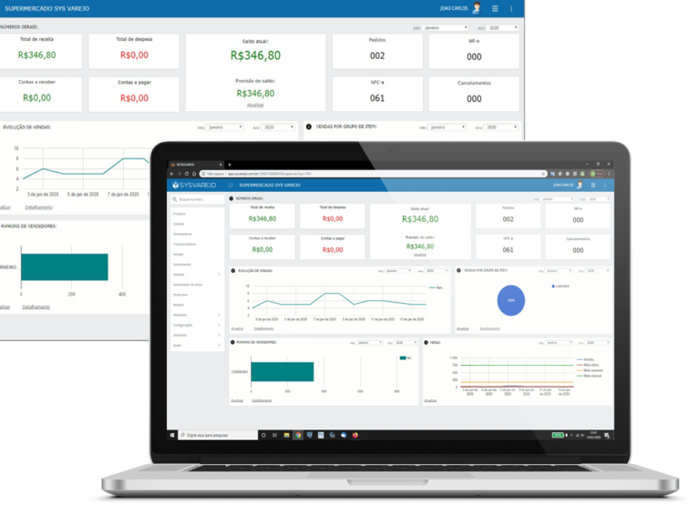

# Retaguarda

> Aqui é concentrado todas informações de vendas e movimentações realizadas nos módulos móbile e frente de loja.

> Além de concentrar informações é possível ter acesso a um dashboard que exibe os resultados de vendas e financeiro de forma gráfica de fácil entendimento, relatórios diversos e todos os cadastros e movimentações de entradas e saídas presente nos outros módulos.

> É possível também importar xml de notas para dar entrada, emitir documentos fiscais, exportar xmls para contabilidade.

> E pode ser acessado de qualquer lugar com conexão a internet.

Cadastrar Produtos
-----------------------------------------------------------------------------------------------

### [Incluindo novo](https://sysvarejo.com.br/docs/documentacao-retaguarda/#incluido-novo)

> Passo 1 – No menu principal do sistema clique na opção **PRODUTOS**.

> Passo 2 – Na tela de produtos clique no **BOTÃO NOVO**.

> Passo 3 – Informe os campos do **CADASTRO** e clique em **SALVAR.**

### [Lendo o código de barras](https://sysvarejo.com.br/docs/documentacao-retaguarda/#lendo)

> Passo 1 – Repetir os passos 1 e 2 do procedimento de cadastro de [**PRODUTOS**](https://sysvarejo.com.br/docs/documentacao-retaguarda/#incluido-novo).
> 
> Passo 2 – Informe o **CÓDIGO DE BARRA** do produto.

### [Grupo de produtos](https://sysvarejo.com.br/docs/documentacao-retaguarda/#grupo-de-rotulo)

> Passo 1 – Clique a opção **CONFIGURAÇÕES** no menu inicial.
> 
> Passo 2 – Clique em **GRUPO DE PRODUTOS**.

> Passo 3 – Informe o campo **DESCRIÇÃO**, e clique em incluir.

### [Múltiplas embalagens](https://sysvarejo.com.br/docs/documentacao-retaguarda/#multiplas-embalagens)

> Passo 1 – Acesse o a opção **PRODUTOS** no menu principal**,** abra o produto que deseja cadastrar a nova embalagem.
> 
> Passo 2 – Selecione a aba **EMBALAGENS.**
> 
> Passo 3 – Clique no botão **INCLUIR** da grade, e informe os campos solicitados.
> 
> Passo 4 – Clique em **SALVAR** para finalizar**.**

### [Produto de balança](https://sysvarejo.com.br/docs/documentacao-retaguarda/#produto-de-balanca)

> Passo 1 – No menu principal do sistema clique na opção **[PRODUTOS](https://sysvarejo.com.br/docs/documentacao-retaguarda/#incluido-novo),** abra o produto que deseja cadastrar como **PRODUTO DE BALANÇA**.
> 
> Passo 2 – Selecione a aba **PARÂMETROS.**
> 
> Passo 3 – Marque a opção **UTILIZA BALANÇA.**
> 
> Passo 4 – Informe o **CÓDIGO DA BALANÇA** e escolha o tipo de etiqueta.
> 
> Exemplo : Uma etiqueta com o código de barras 2 000041 000609 deve ser informado no campo código de balança 41.
> 
> 

### [Grade de produtos](https://sysvarejo.com.br/docs/documentacao-retaguarda/#grade-de-produtos)

> Passo 1 – No menu principal do sistema clique na opção [**PRODUTOS**](https://sysvarejo.com.br/docs/documentacao-retaguarda/#incluido-novo).
> 
> Passo 2 – Selecionar a aba **PARÂMETROS.**
> 
> Passo 3 – Marque a opção **PRODUTO CONTROLA GRADE.**
> 
> Passo 4 – Clique nos três pontos, como demonstrado abaixo.

> Passo 5 – Clique em **INCLUIR**.
> 
> Passo 6 – Preencha o campo **DESCRIÇÃO** e clique no + para incluir variações de produto.

Cadastro de Clientes
-----------------------------------------------------------------------------------------------

### [Incluindo novo](https://sysvarejo.com.br/docs/documentacao-retaguarda/#incluindo-novo)

> Passo 1 – No menu principal do sistema clique na opção **CLIENTES.**
> 
> Passo 2 – Clique em **NOVO.**

> Passo 3 – Preencha os campos necessários como demonstrado abaixo.
> 
> Passo 4 – Clique em **SALVAR.**

Cadastro de Fornecedores
-----------------------------------------------------------------------------------------------------------

### [Incluindo novo](https://sysvarejo.com.br/docs/documentacao-retaguarda/#incluindo-novo)

> Passo 1 – No menu principal do sistema clique na opção **FORNECEDORES.**
> 
> Passo 2 – Clique em **NOVO.**

> Passo 3 – Preencha os campos necessários como demonstrado abaixo.
> 
> Passo 4 – Clique em **SALVAR.**
> 
> 

Cadastro de Transportadoras
-----------------------------------------------------------------------------------------------------------------

### [Incluindo nova](https://sysvarejo.com.br/docs/documentacao-retaguarda/#incluindo-nova-transortadora)

> Passo 1 – No menu principal do sistema clique na opção **TRANSPORTADORAS.**
> 
> Passo 2 – Clique em **NOVO.**

> Passo 3 – Preencha os campos necessários como demonstrado abaixo.
> 
> Passo 4 – Clique em **SALVAR.**

Vendas
-----------------------------------------------------------------------

### [Vender um produto](https://sysvarejo.com.br/docs/documentacao-retaguarda/#como-vender-um-produto)

> Passo 1 – No menu principal do sistema clique na opção **VENDAS.**
> 
> Passo 2 – Clique em **NOVO**

> Passo 3 – Localize o produto usando as seguintes opções.
> 
> *   Código de barra
> *   Código interno
> *   Descrição
> *   Referencia

> Passo 4 – Clique no botão **INCLUIR.**

## [Aplicar desconto no produto](https://sysvarejo.com.br/docs/documentacao-retaguarda/#como-aplicar-desconto-no-produto)

> Passo 1 – Na tela de vendas informe a quantidade de **DESCONTO** que você deseja.
> 
> Passo 2 – Clique em **INCLUIR.**
> 
> Obs : O desconto máximo é configurado na tela de cadastro de caixa.

### [Vender um produto de grade](https://sysvarejo.com.br/docs/documentacao-retaguarda/#vender-um-produto-de-grade)

> Passo 1 – Na tela de [**VENDAS**](https://sysvarejo.com.br/docs/documentacao-retaguarda/#como-vender-um-produto), no campo **VARIAÇÃO** informe qual sera o item.
> 
> Essa opção só estará disponível caso já esteja habilitado no cadastro do produto.

### [Composição de pagamento](https://sysvarejo.com.br/docs/documentacao-retaguarda/#composicao-de-pagamento)

> Passo 1 – Na tela de [VENDAS](https://sysvarejo.com.br/docs/documentacao-retaguarda/#como-vender-um-produto), apos informar o(s) produto(s), clique em **PRÓXIMO.**

> Passo 2 – Informe a **FORMA DE PAGAMENTO**, e clique em **INCLUIR.**

> #### Atenção!
> 
> Quando a forma de pagamento for cartão é necessário informar:
> 
> *   Credenciadora/Administradora
> *   Tipo de bandeira
> *   Número de autorização (NSU)
> 
> * * *
> 
> NSU é a sigla para Número Sequencial Único. **É um número único gerado para identificar uma transação ou uma nota fiscal**..
> 
> Passo 3 – Escolha como deseja finalizar a venda, podendo gerar :
> 
> *   [Orçamento](https://sysvarejo.com.br/docs/documentacao-retaguarda/#gerar-orcamentos)
> *   [Pedido](https://sysvarejo.com.br/docs/documentacao-retaguarda/#gerar-pedido)
> *   [NF-e](https://sysvarejo.com.br/docs/documentacao-retaguarda/#gerar-nf-e)
> *   [NFC-e](https://sysvarejo.com.br/docs/documentacao-retaguarda/#gerar-nfc-e)

Pedidos
-------------------------------------------------------------------------

### [Gerando pedido](https://sysvarejo.com.br/docs/documentacao-retaguarda/#gerando-pedido)

> Passo 1 – No menu principal do sistema clique na opção [**VENDAS.**](https://sysvarejo.com.br/docs/documentacao-retaguarda/#como-vender-um-produto)
> 
> Passo 2 – Clique em **NOVO**
> 
> Passo 3 – Informe o produto de preferência.
> 
> Passo 4 – Informe a forma de pagamento.
> 
> Passo 5 – Clique **GERAR PEDIDO.**

### [Gerando impressão](https://sysvarejo.com.br/docs/documentacao-retaguarda/#gerando-impressao)

> Passo 1 – Após **[GERAR O PEDIDO](https://sysvarejo.com.br/docs/documentacao-retaguarda/#gerando-pedido)** aparecerá uma tela perguntando se deseja imprimir o pedido.
> 
> Obs : Se caso essa tela não aparecer, verifique se o seu navegador não está bloqueando o **POP-UP.**

### [Enviando por email](https://sysvarejo.com.br/docs/documentacao-retaguarda/#enviando-por-email)

> Passo 1 – Após feita a [**IMPRESSÃO DO PEDIDO**](https://sysvarejo.com.br/docs/documentacao-retaguarda/#gerando-impressao), aparecerá outra tela perguntando se deseja enviar por EMAIL.

### [Transformando em orçamento.](https://sysvarejo.com.br/docs/documentacao-retaguarda/#transformando-em-orcamento)

> Passo 1 – No menu principal do sistema clique na opção [**VENDAS.**](https://sysvarejo.com.br/docs/documentacao-retaguarda/#como-vender-um-produto)
> 
> Passo 2 **–** Selecione o **PEDIDO** que deseja transformar em **ORÇAMENTO.**
> 
> Obs : Só e possível gerar orçamento de pedidos em aberto.
> 
> Passo 3 **–** Clique em **GERAR ORÇAMENTO.**

### [Transformando em NF-e](https://sysvarejo.com.br/docs/documentacao-retaguarda/#transformando-em-nf-e)

> Passo 1 – No menu principal do sistema clique na opção [**VENDAS.**](https://sysvarejo.com.br/docs/documentacao-retaguarda/#como-vender-um-produto)
> 
> Passo 2 **–** Selecione o **PEDIDO** que deseja transforma em **NF-e**
> 
> Passo 3 **–** Clique em **EMITIR NF-e.**

### [Transformando em NFC-e](https://sysvarejo.com.br/docs/documentacao-retaguarda/#transformando-em-nfc-e)

> Passo 1 – No menu principal do sistema clique na opção [**VENDAS.**](https://sysvarejo.com.br/docs/documentacao-retaguarda/#como-vender-um-produto)
> 
> Passo 2 – Selecione o **PEDIDO** que deseja transforma em **NFC-e**
> 
> Passo 3 – Clique em **EMITIR NFC-e**.

Orçamentos
------------------------------------------------------------------------------

### [Gerando orçamentos](https://sysvarejo.com.br/docs/documentacao-retaguarda/#gerar-orcamentos)

> Passo 1 – Na tela de [**VENDAS**](https://sysvarejo.com.br/docs/documentacao-retaguarda/#como-vender-um-produto), selecione o pedido que deseja emitir o **ORÇAMENTO**
> 
> Obs : Só é possível **GERAR ORÇAMENTO** de um **PEDIDO EM ABERTO.**
> 
> Passo 2 – Clique em **PRÓXIMO.** 

> Passo 3 – Clique em **GERAR ORÇAMENTO.**

### [Gerando impressão](https://sysvarejo.com.br/docs/documentacao-retaguarda/#gerar-impressao)

> Passo 1 – Após clicar em **GERAR ORÇAMENTO**, selecione a opção **OK** para poder imprimir.
> 
> Obs : Caso não consiga visualizar o seu **ORÇAMENTO** verifique se o seu navegador não está com o bloqueio de **POP-UP** ativo..

### [Enviando por email](https://sysvarejo.com.br/docs/documentacao-retaguarda/#enviando-por-email)

> Passo 1 – Apos clicar em imprimir o seu **ORÇAMENTO.**
> 
> Passo 2 – Clique em **OK** se deseja **ENVIAR O ORÇAMENTO POR EMAI**L.

### [Transformando em pedido](https://sysvarejo.com.br/docs/documentacao-retaguarda/#transformando-or%C3%A7amento-em-pedidos)

> Passo 1 – Selecione o **ORÇAMENTO** que deseja emitir o pedido.
> 
> Passo 2 – Clique em **PRÓXIMO.**
> 
> Passo 3 – Clique em **GERAR PEDIDO**.

### [Transformando em NF-E](https://sysvarejo.com.br/docs/documentacao-retaguarda/#trasformando-or%C3%A7amento%20em-nf-e)

> Passo 1 – Selecione o **ORÇAMENTO** que deseja emitir a **NF-e.**
> 
> Passo 2 – Clique em **PRÓXIMO.**
> 
> Passo 3 – Clique em **NF-e**.

### [Transformando em NFC-E](https://sysvarejo.com.br/docs/documentacao-retaguarda/#Trasformando-or%C3%A7amento-em-nfc-e)

> Passo 1 – Selecione o **ORÇAMENTO** que deseja emitir a **NFC-e.**
> 
> Passo 2 – Clique em **PRÓXIMO.**
> 
> Passo 3 – Clique em **NFC-e**.

### [Reimprimir](https://sysvarejo.com.br/docs/documentacao-retaguarda/#reimprimir)

> Passo 1 – Selecione o **ORÇAMENTO** que deseja **REIMPRIMIR.**
> 
> Passo 2 – Clique em **PRÓXIMO.**
> 
> Passo 3 – Clique em **REIMPRIMIR**.

Estoque
-------------------------------------------------------------------------

### [Auditoria de produto](https://sysvarejo.com.br/docs/documentacao-retaguarda/#auditoria-de-produto)

> Passo 1 – No menu principal do sistema clique em **ESTOQUE.** 
> 
> Passo 2 – Clique em **AUDITORIA DE PRODUTOS.**  
> 
> Passo 3 – Informe o produto que deseja fazer a auditoria. 
> 
> Passo 4 – Altere os valores dos campos conforme seja necessário.   

### [Balanço de estoque](https://sysvarejo.com.br/docs/documentacao-retaguarda/#balanco-de-estoque)

> Passo 1 – No menu principal do sistema clique em **ESTOQUE.** 
> 
> Passo 2 – Clique em **BALANÇO DE ESTOQUE.** 
> 
> Passo 3 – Clique em **INCLUIR**. 
> 
> Passo 4 – Clique em **SALVAR**. 
> 
> Passo 5 – Clique em **INCLUIR PRODUTOS.** 
> 
> Passo 6 – Selecione o **PRODUTO** que deseja e informe a **QUANTIDADE** desejada. 
> 
> Passo 7 – Clique em **FINALIZAR BALANÇO**, caso deseje imprimir clique na opção ao lado **IMPRIMIR.** 

### [Entrada](https://sysvarejo.com.br/docs/documentacao-retaguarda/#entrada)

Devolução
-----------------------------------------------------------------------------

### [Entrada](https://sysvarejo.com.br/docs/documentacao-retaguarda/#entrada)

> Passo 1 – No menu principal do sistema clique em **ESTOQUE.** 
> 
> Passo 2 – Clique em **DEVOLUÇÃO**. 
> 
> Passo 3 – Clique em **NOVO.**
> 
> Passo 4 – Em tipo selecione **ENTRADA.**

> #### Observação
> 
> Aparecerá todas as notas de entrada que já foram importadas para o sistema, caso deseje pode ser feita a filtragem dessas notas por : 
> 
> * * *

> *   Número de controle 
> *   Serie
> *   Número da nota
> *   Chave
> *   Data de movimentação
> *   Fornecedor  

### [Saída](https://sysvarejo.com.br/docs/documentacao-retaguarda/#saida)

> Passo 1 – No menu principal do sistema clique em **ESTOQUE.** 
> 
> Passo 2 – Clique em **DEVOLUÇÃO**. 
> 
> Passo 3 – Clique em **NOVO.**
> 
> Passo 4 – Em tipo selecione **SAIDA.**

> #### Observação
> 
> Aparecerá todas as notas de entrada que já foram importadas para o sistema, caso deseje pode ser feita a filtragem dessas notas por : 
> 
> * * *
> 
> > *   Número de controle
> > *   Serie
> > *   Número da nota
> > *   Chave
> > *   Data de movimentação
> > *   Cliente

Fiscal
-----------------------------------------------------------------------

### [Documentos fiscais](https://sysvarejo.com.br/docs/documentacao-retaguarda/#documentos-fiscais)

> Passo 1 – No menu principal do sistema clique em FISCAL.
> 
> Passo 2 – Clique em DOCUMENTOS FISCAIS.

> #### Observação
> 
> Aqui você tem acesso as notas geradas pelo sistema, podendo ser elas :
> 
> * * *
> 
> > *   Saida – Venda
> > *   Saida – Devolução
> > *   Migração de NF-e para NFC-e
> > *   Entrada – Compra
> > *   Entrada – Devolução

### [Gerenciador de notas](https://sysvarejo.com.br/docs/documentacao-retaguarda/#gerenciador-de-notas)

Financeiro - Caixa
---------------------------------------------------------------------------------------------

### [Incluindo receita](https://sysvarejo.com.br/docs/documentacao-retaguarda/#incluindo-receita)

> Passo 1 – No menu principal do sistema clique em FINANCEIRO.
> 
> Passo 2 – Clique em CAIXA.
> 
> Passo 3 – Clique em INCLUIR LANÇAMENTO.
> 
> Passo 4 – Em tipo selecione RECEITA.
> 
> Passo 5 – Em CATEGORIA selecione uma de sua preferência.
> 
> Obs : Caso não tenha nenhuma cadastrada será necessário cadastrar uma, clique onde estiver 4 barras, para incluir uma categoria.
> 
> Passo 6 – Em RECEBIDO DE, informe o cliente cujo foi recebido a RECEITA.
> 
> Passo 7 – Informe a DATA, FORMA DE PAGAMENTO e VALOR de acordo com a transação.

### [Incluindo despesa](https://sysvarejo.com.br/docs/documentacao-retaguarda/#incluindo-despesa)

> Passo 1 – No menu principal do sistema clique em FINANCEIRO.
> 
> Passo 2 – Clique em CAIXA.
> 
> Passo 3 – Clique em INCLUIR LANÇAMENTO.
> 
> Passo 4 – Em tipo selecione DESPESA.
> 
> Passo 5 – Em CATEGORIA selecione uma de sua preferência.
> 
> Obs : Caso não tenha nenhuma cadastrada será necessário cadastrar uma, clique onde estiver 4 barras, para incluir uma categoria.
> 
> Passo 6 – Em PAGO A, informe o fornecedor cujo foi gerado a DESPESA.
> 
> Passo 7 – Informe a DATA, FORMA DE PAGAMENTO e VALOR de acordo com a transação.

Financeiro - Contas a receber
-------------------------------------------------------------------------------------------------------------------

### [Incluir Titulo](https://sysvarejo.com.br/docs/documentacao-retaguarda/#incluir-titulo)

> Passo 1 – No menu principal do sistema clique em FINANCEIRO.
> 
> Passo 2 – Clique em CONTAS A RECEBER.
> 
> Passo 3 – Clique em INCLUIR LANÇAMENTO.
> 
> Passo 4 – Em CATEGORIA selecione uma de sua preferência.
> 
> Obs : Caso não tenha nenhuma cadastrada será necessário cadastrar uma, clique onde estiver 4 barras, para incluir uma categoria.
> 
> Passo 5 – Em CLIENTE, informe o cliente cujo foi recebido a RECEITA.
> 
> Passo 6 – Informe a DATA, FORMA DE PAGAMENTO e VALOR de acordo com a transação.

Financeiro - Contas a pagar
---------------------------------------------------------------------------------------------------------------

### [Incluir Titulo](https://sysvarejo.com.br/docs/documentacao-retaguarda/#incluir-titulo)

> Passo 1 – No menu principal do sistema clique em FINANCEIRO.
> 
> Passo 2 – Clique em CONTAS A PAGAR.
> 
> Passo 3 – Clique em INCLUIR LANÇAMENTO.
> 
> Passo 4 – Em CATEGORIA selecione uma de sua preferência.
> 
> Obs : Caso não tenha nenhuma cadastrada será necessário cadastrar uma, clique onde estiver 4 barras, para incluir uma categoria.
> 
> Passo 5 – Em FORNECEDOR, informe o cliente cujo foi gerado a DESPESA.
> 
> Passo 6 – Informe a DATA, FORMA DE PAGAMENTO e VALOR de acordo com a transação.

Relatório - Estoque
-----------------------------------------------------------------------------------------------

### [Relatório - Estoque](https://sysvarejo.com.br/docs/documentacao-retaguarda/#relatorio-estoque)

> Passo 1 – No menu principal do sistema clique em RELATORIO.
> 
> Passo 2 – Clique em ESTOQUE, em sequida novamente e ESTOQUE.
> 
> #### Observação!
> 
> Se desejar imprimir apenas produtos abaixo do estoque mínimo selecione na opção abaixo e caso deseje filtrar seu RELATORIO, você pode fazer isso pelos seguintes filtros :
> 
> * * *
> 
> *   Grupo de produtos
> *   Produtos
> 
> Passo 3 – Clique em GERAR RELATORIO.

### [Inventario](https://sysvarejo.com.br/docs/documentacao-retaguarda/#inventario)

> Passo 1 – No menu principal do sistema clique em RELATORIO.
> 
> Passo 2 – Clique em ESTOQUE, em sequida novamente e INVENTARIO.
> 
> #### Observação!
> 
> Caso deseje filtrar seu RELATORIO, você pode fazer isso pelos seguintes filtros :
> 
> * * *
> 
> *   Grupo de produtos
> *   Produtos
> 
> Passo 3 – Clique em GERAR RELATORIO.

Relatórios - Vendas
-----------------------------------------------------------------------------------------------

### [Custo de vendas](https://sysvarejo.com.br/docs/documentacao-retaguarda/#custo-de-vendas)

> Passo 1 – No menu principal do sistema clique em **RELATÓRIOS.**
> 
> Passo 2 – Clique em **VENDAS** e selecione a opção CUSTO DE VENDAS.
> 
> Passo 3 – Escolha a **DATA INICIAL** e a **FINAL**, que deseja gerar o **RELATÓRIO**.
> 
> Observação : Esse relatório pode ser **FILTRADO** por :

*   > Grade de produto
    
*   > Produto