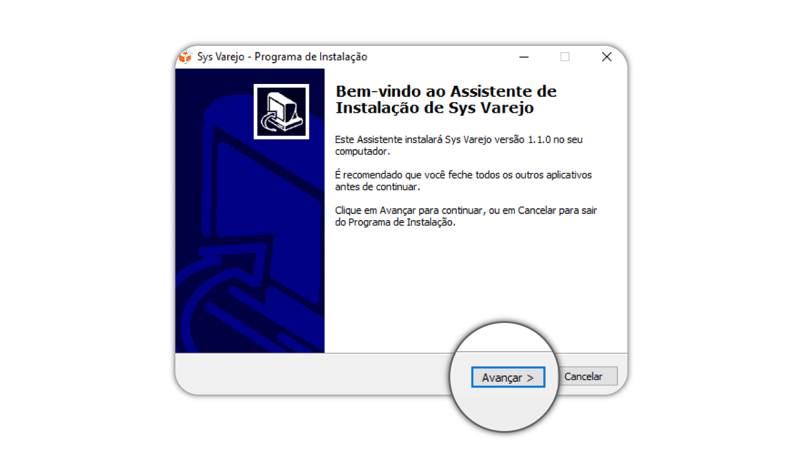
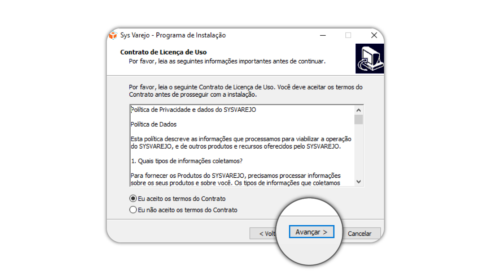
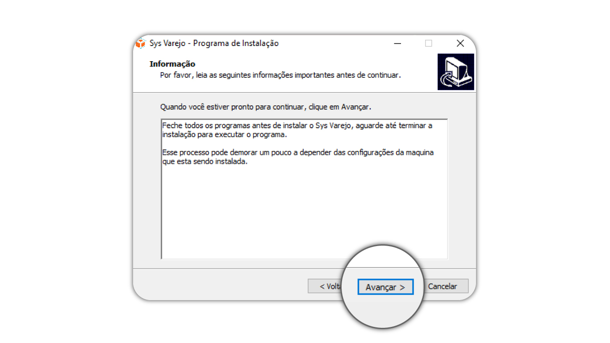
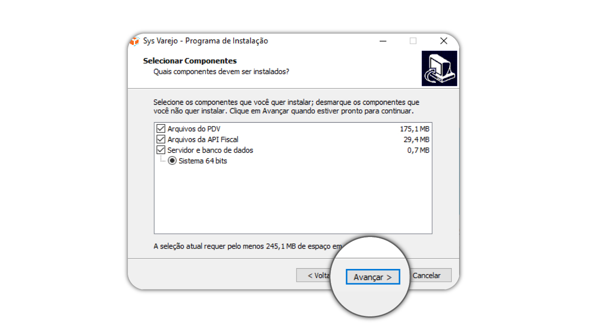
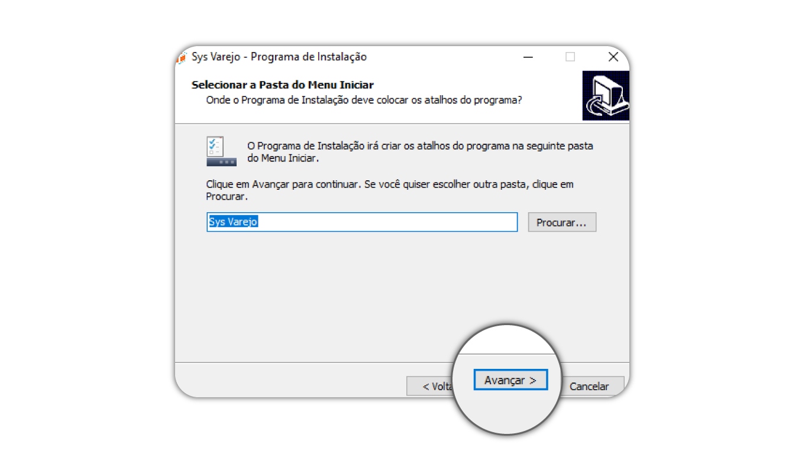
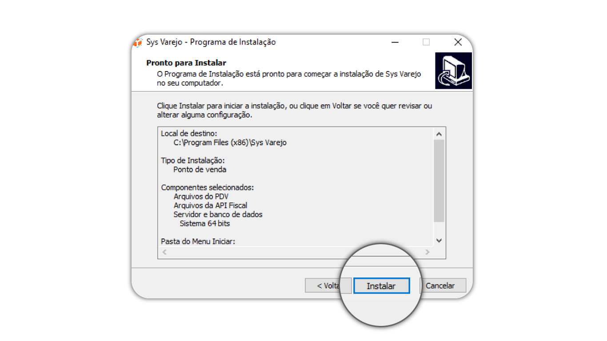
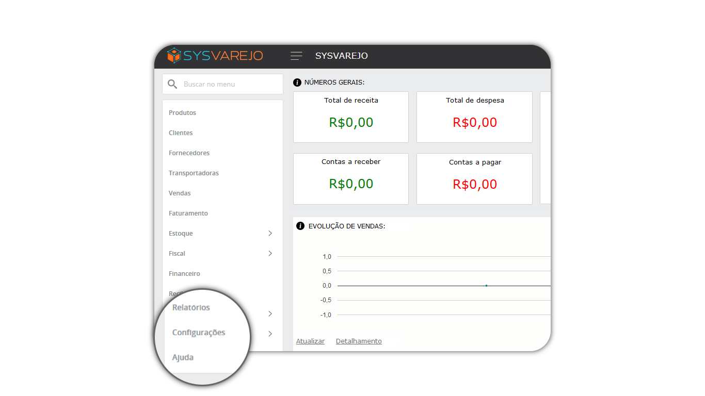
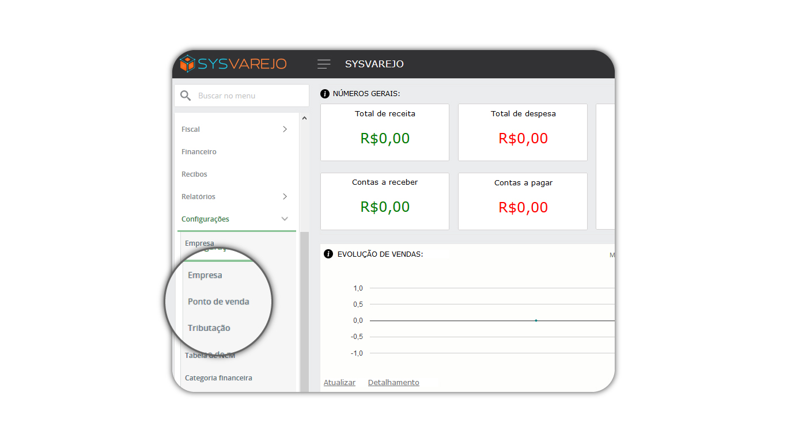
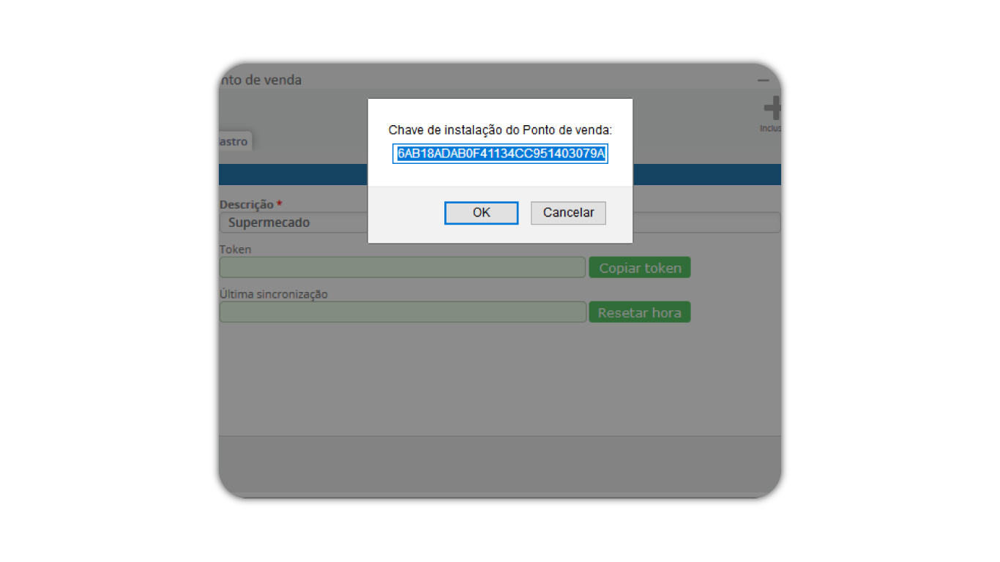
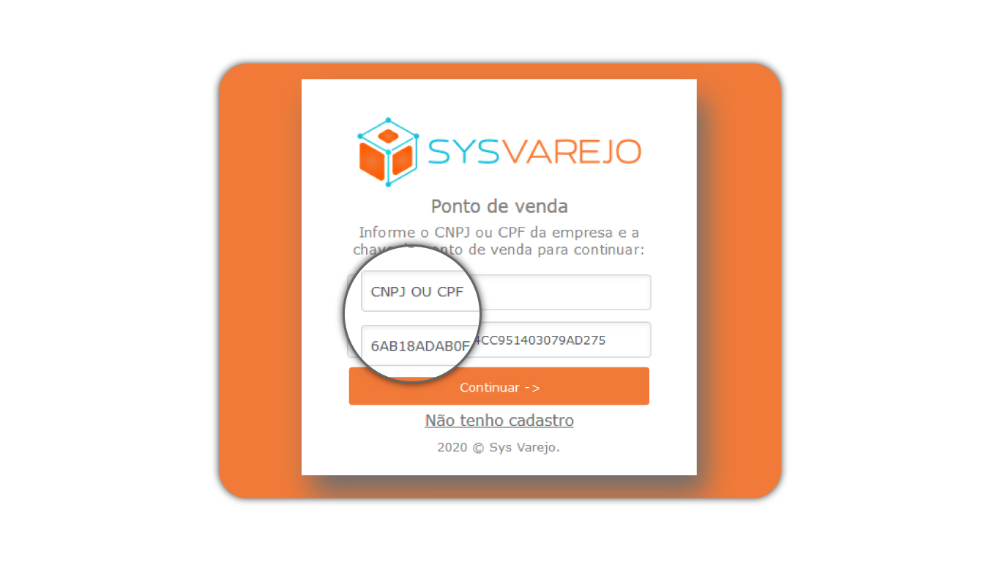

# PDV

## Instalação

> Passo 1 – Baixe o **SISTEMA.**
> 
> Passo 2 – Execute como **ADMINISTRADOR.**
>
> Passo 3 – Clique em **AVANÇAR.**



> Passo 4 – Selecione **EU ACEITO OS TERMOS DO CONTRATO.** 
>
> Passo 5 – Clique em **AVANÇAR.**



> Passo 6 – Clique em **AVANÇAR.**

 

###### Observação !

Caso esteja fazendo uma atualização do sistema, será necessário desmarcar a opção 
```SERVIDOR E BANCO DE DADOS e parar os serviços SYSVAREJO e o serviço API FISCAL !```

Pois caso deixe marcado será criado um novo banco de dados.

> Passo 7 – Clique em **AVANÇAR.**



> Passo 8 – Clique em **AVANÇAR.**



> Passo 9 – Clique em **INSTALAR.**



## Criando ponto de venda

> Passo 1 – Apos a **INSTALAÇÃO DO SISTEMA**, abra a retaguarda e faça o login com as informações que você recebeu por email.

> Passo 2 – No menu principal do sistema clique **CONFIGURAÇÕES.**



> Passo 3 – Selecione a opção **PONTO DE VENDA.**



> Passo 4 – Clique em **INCLUIR.**

> Passo 5 – Em **DESCRIÇÃO** informe o nome do ponto de venda.

> Obs : Aparecera um caixa de dialogo com um código, copie esse código pois será necessário para inciar o ponto de venda.



> Passo 6 – Acesse o **PDV.** 

> Passo 7 – Informe o **CNPJ** e o **CÓDIGO** que anteriormente foi gerado na **RETAGUARDA.**

